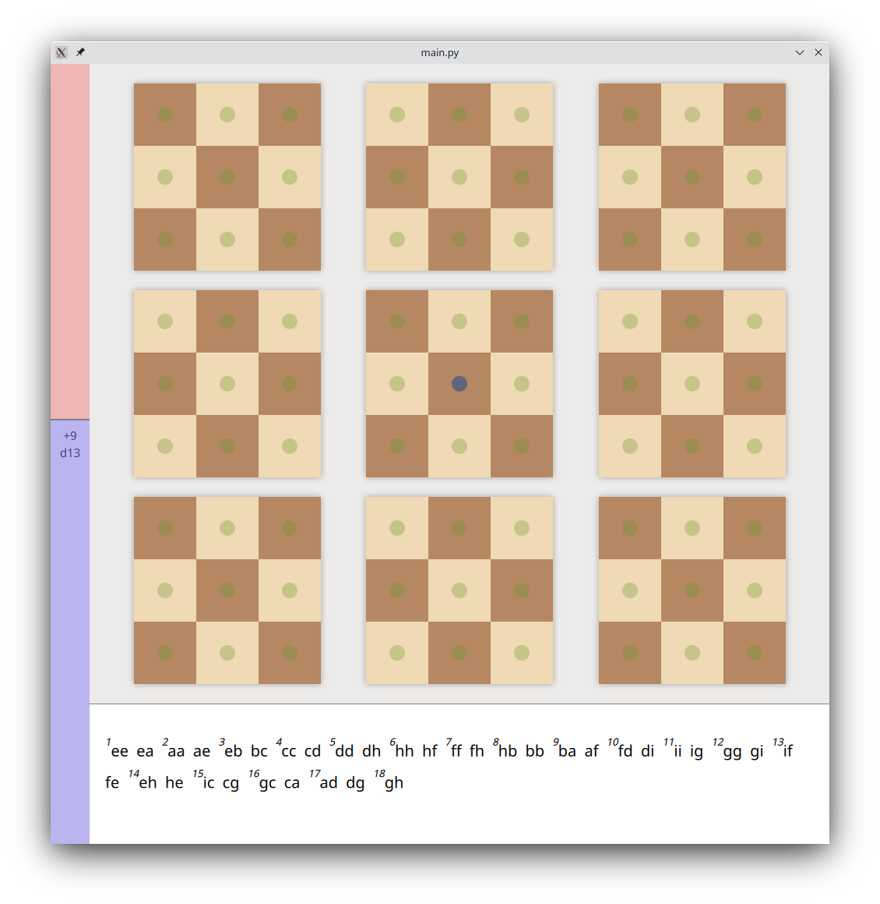
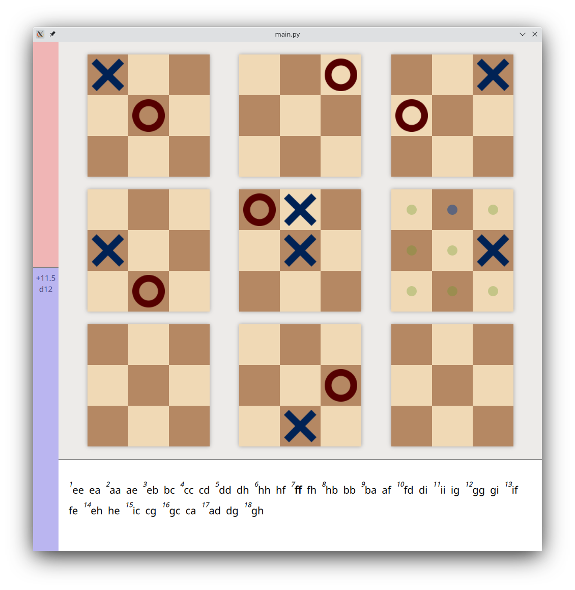
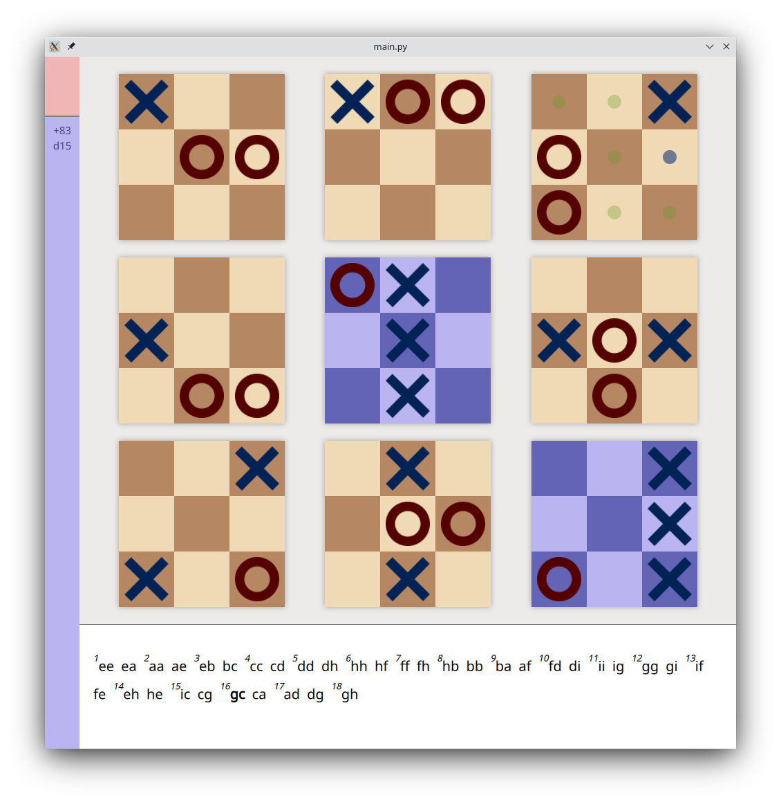
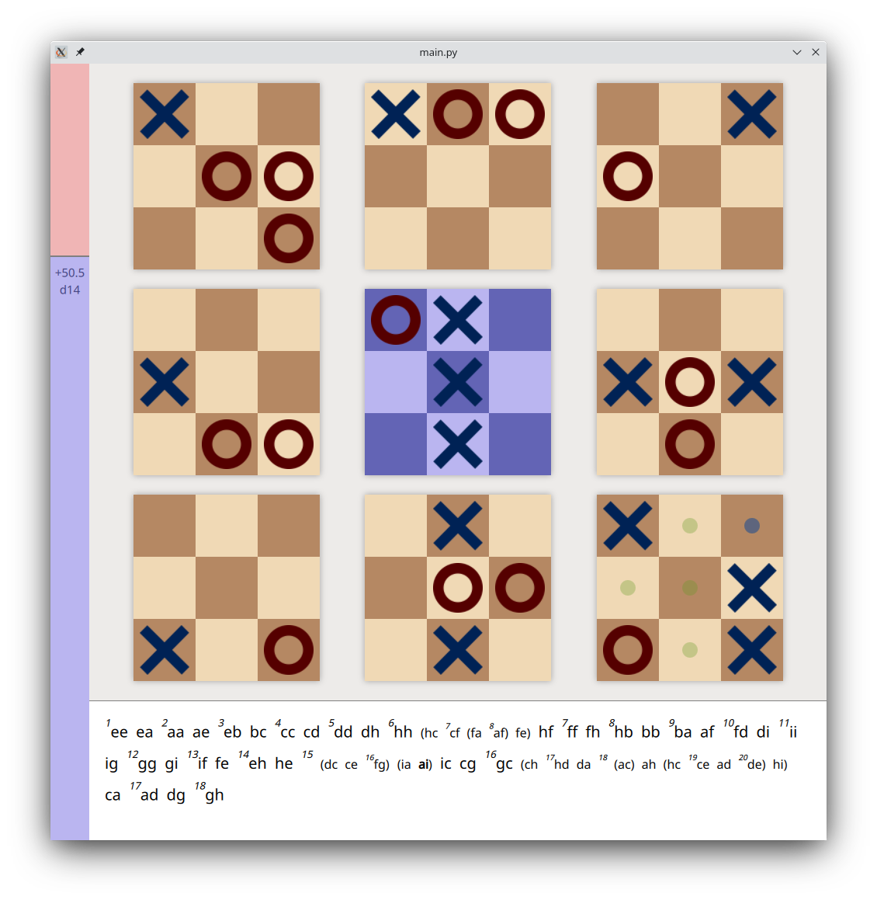

# Ultris

This is an application made to analyse games of Ultimate Tic Tac Toe. If you don't know about UTTT, it is a variant of Tic Tac Toe that's not yet solved and quite fun to play. You can start learning about it [here](https://en.wikipedia.org/wiki/Ultimate_tic-tac-toe).

## Features

Currently supported, we have the ability to see the evaluation of a position and the eval depth, powered by the project [ultimattt](https://github.com/nelhage/ultimattt). If the game is a forced win or loss, that's displayed as a 100 score and the depth is the number of moves until the forced win.

Boards are colored depending on whether they are won or not by one of the players, and all playable moves are shown. The top engine move is also highlighted with a blue dot.

You can import games with a syntax described below; you can go through the various moves (by clicking on them, or via arrow keys) but also explore alternative variations, which will be shown in rounded brackets.

## Dependencies

This requires PySide2 (and a functioning Qt install). This also requires [ultimattt](https://github.com/nelhage/ultimattt) to be compiled; the path to the ultimattt executable has to be set as an environment variable called `ULTIMATTT_PATH`.

## Importing games

To load a game, pass it as an argument. The syntax for the games is a space-separated list of moves. Each move will first say which board it plays on - choosing between `N`, `S`, `W`, `E`, `NW`, `NE`, `SW`, `SE`, `C` - then a `/`, then the spot to play in within that board, again choosing between the same options. As an example, the move that plays in the central spot of the topleft board will be `NW/C`.

An example game, which you can copypaste as a test, is:

`"C/C C/NW NW/NW NW/C C/N N/NE NE/NE NE/W W/W W/S S/S S/E E/E E/S S/N N/N N/NW NW/E E/W W/SE SE/SE SE/SW SW/SW SW/SE SE/E E/C C/S S/C SE/NE NE/SW SW/NE NE/NW NW/W W/SW SW/S"`

If you don't import any game, the app will start black and you'll be able to play out the game yourself. There is currently no export function.
